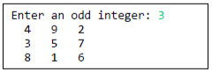
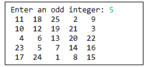

# Programming in Science - Lab 8

This template repository is the starter project for **Programming in Science Lab 8**. Written in Python, and tested with Pytest.

### Question(s)

1. **(50%)** Magic Square Validation:
   
   - Write a function `is_magic_square(matrix)` that checks if a given **N x N** matrix is a magic square.
   
   #### Example:
   ```python
   is_magic_square([[4, 9, 2], [3, 5, 7], [8, 1, 6]])  # Returns True
   is_magic_square([[4, 9, 2], [8, 1, 6], [3, 5, 7]])  # Returns False
   ```
   ✅ **Hints:** Verify that all rows, columns, and both diagonals sum to the same value.

2. **(50%)** Magic Square Generator:
   
   - Write a function `generate_magic_square(n)` that generates an **N x N** magic square for an odd integer **N**.
   
   #### Example:
   ```python
   generate_magic_square(3)
   ```
     

   ```python
   generate_magic_square(5)
   ```
   

   ✅ **Hints:** Start at the **bottom middle** and use diagonal movement to the **right and down**, wrapping around where necessary.

### Run Command

To run the tests, use the following command:

```
pytest
```